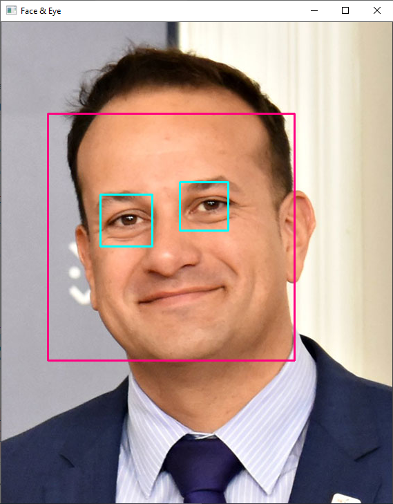
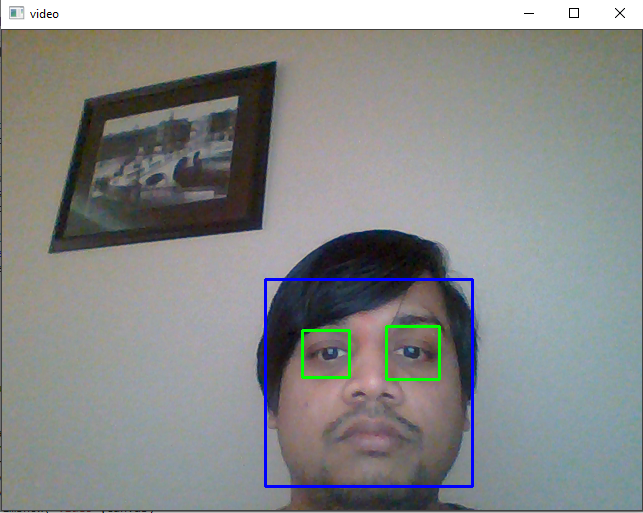
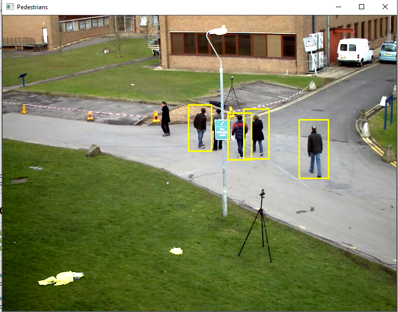
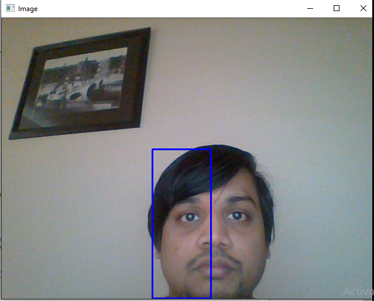
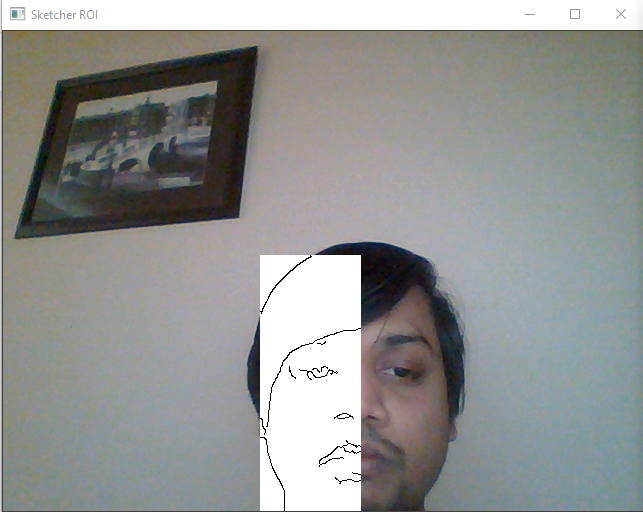

# Computer-Vision-Tutorials using OpenCV in Python

### (1) [Tutorial1 : Reading,writing and displaying images](https://github.com/NitinNandeshwar/Computer-Vision-Tutorials/blob/main/Tutorial1.ipynb)

### (2) [Tutorial2 : Faces and Eye detection from Images using HAAR Cascade Classifier](https://github.com/NitinNandeshwar/Computer-Vision-Tutorials/blob/main/Tutorial2.ipynb)

Fig: Output of Faces and Eye detection from images

### (3) [Tutorial1 : Face and Eye Detection from Webcam using HAAR Cascade Classifier](https://github.com/NitinNandeshwar/Computer-Vision-Tutorials/blob/main/Tutorial3.ipynb)

Fig: Output of Faces and Eye detection from live Webcam

### (4)[Tutorial4 : Padestrian and Car detection using OpenCV from Video](https://github.com/NitinNandeshwar/Computer-Vision-Tutorials/blob/main/Tutorial4.ipynb)

Fig: Output of Pedestrian detection from Video

### (5)[Tutorial5 :Sketch the image from webcam using a live feed](https://github.com/NitinNandeshwar/Computer-Vision-Tutorials/blob/main/Tutorial5.ipynb)

Fig: Input of live webcam

Fig: Output of Sketch process of ive webcam
